# 摘要

  在软件开发过程中，开发者常面临跨项目 Bug 解决效率低、问题解决经验难以复用的行业痛点，而现有工具多聚焦于项目内协作，缺乏轻量化的社区型 Bug 共享与对接场景。
  为解决上述问题，本文设计并实现了一款基于 Vue3 + NestJS 的前后端分离式开发者 Bug 共享社区平台，采用 pnpm + Turbo 的 monorepo 工程化架构，前端拆分为用户端（fe-h5）与管理端（fe-admin），后端为 NestJS 单体服务（be-main），共享包 @bug/shared 统一类型与常量，采用 MySQL 作为关系型数据库实现结构化数据存储。
  平台聚焦 Bug 发布与承接核心业务，结合人工运营模式，通过社群对接实现 Bug 解决的线下沟通，具备可配置的时效规则、定时时效监控（如每 5 分钟）与后台人工介入、操作日志功能，解决线上协作的需求理解与调试落地难题，探索轻量化 Bug 共享平台的商业落地模式。
  本文详细阐述了平台的需求分析、技术架构设计（含 monorepo 与多端划分）、核心功能模块开发及数据库设计过程，通过实践前后端分离与代码设计环节，完成了高可维护、可扩展的 Bug 共享平台搭建，有效提升了开发者之间 Bug 解决的协作效率，实现了对 Vue3 + NestJS 全栈技术栈及 monorepo 工程化实践的深度应用，为同类平台的商业探索提供了参考。
  

  关键词：Bug 共享平台；前后端分离；Vue3；NestJS；monorepo；MySQL；JWT 鉴权；人工运营；社群对接

---

# ABSTRACT

  In the process of software development, developers often face industry pain points such as low efficiency in resolving cross-project bugs and difficulty in reusing problem-solving experience. Existing tools mostly focus on intra-project collaboration and lack lightweight community-based scenarios for bug sharing and matching. To address these issues, this paper designs and implements a developer bug sharing community platform based on Vue3 and NestJS with a separated front-end and back-end architecture. The project adopts a pnpm + Turbo monorepo structure, with the front-end split into a user client (fe-h5) and an admin client (fe-admin), the back-end as a NestJS monolithic service (be-main), and a shared package (@bug/shared) for unified types and constants. MySQL is used as the relational database for structured data storage. The platform focuses on bug publishing and taking, combines a manual operation model, and enables offline communication for bug resolution through community connection. It provides configurable time rules, scheduled time monitoring (e.g. every 5 minutes), manual backend intervention, and operation logging, so as to address demand understanding and debugging implementation in online collaboration and to explore a commercial landing model for lightweight bug sharing platforms. This paper elaborates on the platform’s requirement analysis, technical architecture design (including monorepo and multi-client layout), core functional module development, and database design. Through the practice of front-end and back-end separation and code design, a highly maintainable and scalable bug sharing platform has been built, which effectively improves the collaboration efficiency of bug resolution among developers. It also demonstrates in-depth application of the Vue3 + NestJS full-stack technology stack and monorepo engineering practice, providing a reference for the commercial exploration of similar platforms.

  Key words: Bug Sharing Platform; Separation of Front-end and Back-end; Vue3; NestJS; Monorepo; MySQL; JWT Authentication; Manual Operation; Community Connection

---

# 目录

| 1  引言 | 页码 |
|---------|------|
| 1.1  研究背景 | 页码 |
| 1.2  国内外研究现状 | 页码 |
| 1.3  实践意义 | 页码 |
| 1.4  技术意义 | 页码 |
| 1.5  研究内容与结构安排 | 页码 |
| 2  相关技术与理论基础 | 页码 |
| 2.1  前端核心技术 | 页码 |
| 2.2  后端核心技术 | 页码 |
| 2.3  数据库技术 | 页码 |
| 2.4  人工运营模式 | 页码 |
| 3  平台需求分析 | 页码 |
| 3.1  功能需求 | 页码 |
| 3.2  非功能需求 | 页码 |
| 3.3  需求总结 | 页码 |
| 4  平台总体设计 | 页码 |
| 4.1  前端展示层 | 页码 |
| 4.2  后端服务层 | 页码 |
| 4.3  数据存储层 | 页码 |
| 4.4  运营支撑层 | 页码 |
| 5  功能模块设计 | 页码 |
| 5.1  用户模块 | 页码 |
| 5.2  Bug 发布与承接模块 | 页码 |
| 5.3  Bug 列表筛选模块 | 页码 |
| 5.4  后台管理模块 | 页码 |
| 6  数据库设计 | 页码 |
| 6.1  用户表 | 页码 |
| 6.2  Bug 信息表 | 页码 |
| 6.3  运营日志表 | 页码 |
| 6.4  时效规则配置表 | 页码 |
| 6.5  数据表关联关系 | 页码 |
| 6.6  核心业务流程设计 | 页码 |
| 7  前端详细实现与代码设计 | 页码 |
| 7.1  前端开发环境与工程结构 | 页码 |
| 7.2  公共功能与代码设计 | 页码 |
| 7.3  用户端：用户与 Bug 发布承接 | 页码 |
| 7.4  用户端：Bug 列表与筛选 | 页码 |
| 7.5  管理端实现 | 页码 |
| 8  后端详细实现与代码设计 | 页码 |
| 8.1  后端开发环境与项目结构 | 页码 |
| 8.2  公共模块与代码设计 | 页码 |
| 8.3  用户模块与认证 | 页码 |
| 8.4  Bug 模块与列表查询 | 页码 |
| 8.5  后台管理模块 | 页码 |
| 8.6  定时任务与时效监控 | 页码 |
| 8.7  运营日志与数据追溯 | 页码 |
| 9  平台功能测试 | 页码 |
| 9.1  测试目的 | 页码 |
| 9.2  核心功能完整性 | 页码 |
| 9.3  流程测试：人工运营全流程可行性 | 页码 |
| 9.4  时效测试：时效监控准确性 | 页码 |
| 9.5  权限测试：角色与接口权限控制有效性 | 页码 |
| 9.6  性能测试：高并发与大数据量处理 | 页码 |
| 9.7  兼容性测试：多终端多浏览器适配 | 页码 |
| 9.8  测试总结 | 页码 |
| 10  总结与展望 | 页码 |
| 10.1  研究总结 | 页码 |
| 10.2  项目不足 | 页码 |
| 10.3  未来展望 | 页码 |
| 致谢 | 页码 |
| 参考文献 | 页码 |
| 附录 | 页码 |

---

# 文本主体

## 一、引言

### 1.1 研究背景

  随着软件开发行业的快速发展，各类项目的技术栈日趋多元化，开发者在日常开发中遇到的 Bug 类型也更加复杂。
  目前，开发者解决 Bug 的渠道多为项目内部沟通、技术论坛发帖或搜索引擎检索，存在沟通效率低、问题匹配度差的问题；而 GitHub Issues、GitLab Issues 等主流工具，核心定位为项目内的问题跟踪与协作，无法满足跨项目、跨团队的 Bug 共享与对接需求。
  此外，大量开发者解决的典型 Bug 及解决方案缺乏系统化的存储与复用渠道，导致同类问题反复出现，增加了开发的时间成本。
  

  而现有技术社区类平台的互动功能冗余，核心 Bug 解决的协作链路不清晰，且线上无法完成 Bug 解决的全流程需求理解、调试落地，导致实际协作效率偏低。
  基于此，本平台简化非核心社区功能，聚焦 Bug 发布与承接核心业务，结合人工运营与社群对接模式，实现线上信息匹配、线下高效沟通，同时通过平台实现 Bug 对接的时效监控与人工介入，探索轻量化 Bug 共享平台的商业落地路径，解决行业实际协作痛点。
  

### 1.2 国内外研究现状

  在国外，软件开发协作工具的发展较为成熟，GitHub、GitLab 等平台构建了完善的项目内协作生态，但其核心聚焦于项目生命周期管理，缺乏跨项目的 Bug 共享与社区化互动功能；Stack Overflow 等技术问答平台虽支持开发者问题交流，但以非结构化的问答为主，缺乏针对 Bug 的发布、承接、状态跟踪等专业化功能，且同样无法解决线上协作的调试落地难题。
  

  在国内，各类技术社区如掘金、CSDN 等提供了开发者技术交流的渠道，部分平台增设了问题求助板块，但多以问答形式为主，冗余的互动功能导致核心 Bug 协作链路不清晰，且未结合人工运营模式，无法解决需求理解、调试落地的线下协作需求；而企业级的 Bug 管理工具如禅道、Jira，主要面向企业内部项目管理，操作复杂度高，不适用于个人开发者的轻量化协作需求，也缺乏商业落地的轻量化探索。
  

  整体而言，目前国内外尚未有针对开发者群体的、轻量化的“线上匹配 + 线下协作 + 人工运营”的 Bug 共享与对接平台，本项目的开发恰好填补了这一市场空白，为同类平台的设计与商业探索提供了参考。
  

### 1.3 实践意义

  本平台的开发与实现，针对性解决了开发者跨项目 Bug 协作效率低、经验难复用，以及线上协作无法落地调试的行业痛点，通过“线上平台匹配 + 线下社群沟通 + 人工运营介入”的模式，为开发者提供了轻量化的 Bug 发布、承接与对接渠道，有效降低了开发者解决跨项目 Bug 的时间成本，提升了软件开发的整体协作效率。
  同时，平台的时效监控与人工介入功能，保障了 Bug 对接的服务质量，为轻量化 Bug 共享平台的商业探索提供了可落地的实践方案。
  

### 1.4 技术意义

  本项目以 Vue3 + NestJS 为核心技术栈，采用 pnpm + Turbo 的 monorepo 工程化架构，实践了前后端分离、多包统一管理与构建的现代化开发模式，完成了从需求分析、架构设计到功能开发、接口联调的全流程开发工作。
  

  在工程架构上，将后端服务（be-main）、管理端前端（fe-admin）、用户端前端（fe-h5）与共享逻辑（shared）纳入同一仓库，通过 Turbo 实现多包依赖与构建编排，通过 @bug/shared 共享包实现前后端类型、常量与枚举的统一，降低了联调与维护成本。
  

  在前端方面，基于 Vue3 组合式 API、Pinia 状态管理、Vue Router 与 Vite 构建工具，管理端采用 Element Plus 搭建后台运营界面，用户端（fe-h5）支持移动化访问与富文本编辑（wangEditor），实现了多端一致的技术栈与体验。
  

  在后端方面，基于 NestJS 的模块化设计，完成了 JWT 鉴权、TypeORM + MySQL 持久化、Swagger 接口文档、以及 @nestjs/schedule 定时任务等能力的落地；针对平台的人工运营需求，设计了可配置的时效规则、基于定时任务的时效监控（预警/超期状态）以及后台人工介入、操作日志等个性化功能，提升了平台的实用性与落地性。
  

  通过本项目的开发，将理论知识与实际开发相结合，为后续同类全栈及 monorepo 项目的开发积累了实践经验。
  

### 1.5 研究内容与结构安排

  本文主要围绕开发者 Bug 共享社区平台的设计与实现展开研究，核心内容包括平台的需求分析、技术架构设计（含 monorepo 与多端划分）、核心功能模块开发、数据库设计及人工运营功能（时效监控、人工介入等）的落地。
  

  本文的结构安排如下：第一部分为引言，阐述研究背景、意义、国内外研究现状及研究内容；第二部分为平台相关技术与理论基础，介绍本项目所使用的核心技术栈（Vue3、NestJS、monorepo、TypeORM、JWT 等）及相关理论；第三部分为平台的需求分析，结合人工运营模式明确平台的功能需求与非功能需求；第四部分为平台的总体设计，包括架构设计（含前后端与 monorepo 结构）、功能模块设计、数据库设计；第五部分为平台的详细实现，分管理端前端、用户端前端与后端阐述核心功能模块的开发过程，重点实现时效监控、人工介入及操作日志等个性化功能；第六部分为平台的功能测试，验证平台功能的有效性；第七部分为总结与展望，总结本项目的开发成果，分析存在的不足并提出未来商业与功能优化方向。
  

---

## 二、相关技术与理论基础

### 2.1 前端核心技术

  Vue3 是一款渐进式的前端框架，相比 Vue2，其采用了组合式 API（Composition API），将相关功能的代码进行聚合，提升了代码的可维护性与复用性。
  同时，Vue3 原生支持 TypeScript，通过强类型检查有效降低了开发过程中的语法错误，提升了项目的开发质量。
  本平台的管理端（fe-admin）与用户端（fe-h5）均基于 Vue3 开发，实现多端统一的技术栈与开发体验。
  

  Vite 是一款基于 ES 模块的前端构建工具，相比传统的 Webpack，Vite 采用了“按需编译”的策略，在开发环境下无需打包所有文件，大幅提升了项目的启动速度与热更新效率，有效降低了前端开发的等待成本，适配本项目快速开发与调试的需求。
  

  Pinia 是 Vue3 的官方状态管理库，替代了原有的 Vuex，其设计更加简洁，无需区分 Mutations、Actions，支持同步与异步操作，同时原生支持 TypeScript，与 Vue3 的组合式 API 高度适配，能够高效管理本平台的全局状态，如用户登录状态、全局筛选条件、Bug 状态等。
  

  Vue Router 是 Vue 的官方路由库，为本平台的前端多页面导航与权限控制提供支持，管理端与用户端分别配置各自的路由与守卫，实现登录校验与页面跳转的集中管理。
  

  Axios 是一款基于 Promise 的 HTTP 客户端，支持浏览器与 Node.js 环境，具备请求拦截、响应拦截、请求取消、错误处理等功能，是本平台前端与后端进行接口通信的核心工具，通过 Axios 实现前端请求的封装与后端数据的接收，保障前后端数据交互的稳定性。
  

  管理端（fe-admin）采用 Element Plus 组件库搭建后台运营界面，提供表格、表单、分页、消息提示等通用组件，满足后台订单管理、用户管理、时效规则配置、人工介入与操作日志查看等管理功能的前端实现需求。
  

  用户端（fe-h5）采用 wangEditor 作为富文本编辑器，作为前端 Bug 问题描述的核心组件，支持文字格式化、代码块、换行等功能，满足开发者对 Bug 问题的详细描述需求，替代传统的纯文本输入，提升问题描述的准确性与可读性，同时兼顾移动端与 PC 端的访问体验。
  

  在工程化方面，本平台采用 pnpm 作为包管理器、Turbo 作为 monorepo 构建编排工具，将后端（be-main）、管理端前端（fe-admin）、用户端前端（fe-h5）与共享包（shared）置于同一仓库，实现依赖统一安装与多包增量构建。
  共享包 @bug/shared 负责前后端共用的类型定义、枚举常量（如 Bug 状态、时效状态、操作类型等）的导出，保障前后端类型一致，降低联调与维护成本。
  

### 2.2 后端核心技术

  NestJS 是一款基于 Node.js 的企业级后端框架，采用了模块化、面向对象、函数式编程等多种设计思想，其核心特性为依赖注入与模块化设计，能够将后端系统拆分为多个独立的模块，如用户模块、认证模块、Bug 模块、订单模块、后台管理模块等，提升了系统的可扩展性与可维护性。
  NestJS 原生支持 TypeScript，与前端技术栈及共享包实现了类型统一，降低了前后端协作的成本，同时适配本平台时效监控、人工介入等个性化业务逻辑的开发。
  

  JWT（JSON Web Token）是一种轻量级的身份验证协议，通过将用户信息加密为令牌，实现前后端的无状态鉴权。
  在本平台中，用户登录后由后端生成 JWT 令牌并返回给前端，前端后续的所有请求均携带该令牌，后端通过验证令牌的有效性实现用户身份校验，相比传统的 Session 鉴权，JWT 无需服务端存储会话信息，适配前后端分离的开发模式。
  本平台结合 NestJS 的 Passport 与 JWT 策略，实现接口级的身份校验与角色区分（普通用户与管理员）。
  

  TypeORM 是一款基于 TypeScript 的 ORM（对象关系映射）框架，支持多种关系型数据库，包括 MySQL。
  TypeORM 将数据库表与后端实体类进行映射，通过面向对象的方式实现数据库的增删改查操作，无需编写复杂的 SQL 语句，提升了后端数据库开发的效率，同时有效降低了 SQL 注入的风险，适配本平台多条件筛选、时效监控等数据查询需求。
  

  本平台使用 Swagger 生成并暴露接口文档，便于前端对接与联调，同时为后续接口规范与协作提供统一入口。
  

  定时任务采用 NestJS 的 @nestjs/schedule 模块，实现平台的 Bug 时效监控功能。
  后台可配置多组时效规则（如针对“已承接”“沟通中”等状态设定预警时长与超期时长），定时任务按固定周期（如每 5 分钟）扫描符合条件的 Bug，根据最后更新时间或承接时间与规则中的预警、超期阈值进行比较，将 Bug 标记为正常、预警或超期，为后台人工介入与运营决策提供数据支撑。
  

### 2.3 数据库技术

  MySQL 是一款开源的关系型数据库，具备高性能、高可靠性、易维护等特性，支持多种数据类型与复杂的关联查询，适合存储结构化的关系型数据。
  本平台中的用户信息、Bug 信息、时效规则、后台操作日志等均为结构化数据，且存在复杂的关联关系（如用户与 Bug 的发布/承接关系、Bug 与时效规则及时效状态的关联关系），MySQL 能够高效实现此类数据的存储与查询，满足平台的业务需求，同时支持索引优化，提升 Bug 列表多条件筛选的查询效率。
  本平台在部署上支持通过 Docker Compose 一键启动 MySQL 及应用服务，便于开发与演示环境搭建。
  

### 2.4 人工运营模式

  本平台采用“线上信息匹配 + 线下社群沟通 + 人工运营介入”的轻量化运营模式，线上平台仅负责 Bug 的发布、承接、状态跟踪与时效监控，解决 Bug 信息的精准匹配问题；线下通过微信群/QQ 群实现发布人与承接人的直接沟通，完成需求理解、调试落地等核心协作环节；后台通过可配置的时效规则与定时时效监控、人工介入（如订单状态流转、运营备注）及操作日志功能，解决社群沟通中的时效问题、纠纷问题，保障服务质量，为后续平台的商业变现（如服务费、会员制）探索基础模式。
  

---

## 三、平台需求分析

### 3.1 功能需求

  用户模块具有注册功能、登录功能、用户信息管理、权限控制。
  平台区分普通用户与管理员（含超级管理员），管理端与用户端分别基于角色进行接口与页面访问控制。
  

  Bug 发布与承接模块具有 Bug 发布功能、Bug 承接功能、Bug 状态更新功能、社群对接指引。
  用户端（fe-h5）支持发布与承接操作，Bug 状态包括待解决、已承接、沟通中、已解决等流转节点，承接成功后可为发布人与承接人提供社群对接指引，便于线下沟通。
  

  Bug 列表筛选模块具有多条件筛选、关键词搜索、列表排序、详情查看。
  支持按 Bug 状态、时效状态（正常、即将超期、已超期）等条件筛选，结合关键词搜索与分页，用户可快速定位目标 Bug 并查看详情。
  

  后台管理与人工介入模块具有时效监控功能、人工提醒功能、人工介入功能、Bug 数量管理、用户管理功能、运营日志记录。
  管理端（fe-admin）提供时效规则配置（按 Bug 状态配置预警时长与超期时长）、定时时效监控（将 Bug 标记为即将超期或已超期）及超期/预警列表查看，为人工提醒与介入提供数据支撑；支持管理员对订单状态进行人工介入（含运营备注），所有人工介入及关键操作均记录至操作日志，便于追溯；同时提供 Bug/订单列表管理、数量统计与用户管理（查询、状态与角色管理）等功能。
  

### 3.2 非功能需求

  页面响应速度：前端页面首次加载时间不超过 3s，Bug 列表多条件筛选、关键词搜索的接口响应时间不超过 500ms，保障用户操作体验。
  管理端与用户端均基于 Vite 构建，提升首屏与热更新效率。
  

  并发处理能力：平台支持至少 200 人同时在线操作，核心接口（如 Bug 发布、承接、状态更新）支持高并发请求，无数据丢失或错乱问题；后台时效监控采用定时任务批量处理，不影响平台正常请求响应。
  

  数据查询效率：支持对海量 Bug 数据（如 10 万条以上）的快速查询，多条件筛选与关键词搜索的查询结果展示时间不超过 1s，通过数据库索引与 TypeORM 查询优化实现高效查询。
  

  界面设计：前端界面简洁、直观，符合开发者的使用习惯。
  用户端（fe-h5）与管理端（fe-admin）分工明确，核心功能（发布 Bug、承接 Bug、筛选列表）操作流程不超过 3 步，无需复杂的学习成本即可完成核心操作。
  

  交互体验：支持表单验证、操作提示、异常反馈等功能，如密码输入错误、Bug 信息未填写完整时，给出明确的提示信息；Bug 承接成功后自动弹出社群对接指引，提升对接效率；支持页面的无刷新更新，如状态更新、列表筛选后无需刷新页面即可展示最新数据。
  

  富文本编辑体验：用户端 Bug 问题描述采用 wangEditor 富文本编辑器，支持常用功能（文字加粗、换行、代码块、列表等），操作简单，适配开发者的问题描述习惯，同时支持内容在提交前的本地编辑与校验，降低误操作带来的信息不完整风险。
  

  数据可靠性：数据库支持定期备份，防止用户信息、Bug 信息、时效规则、运营日志等核心数据丢失；后端对所有请求进行参数校验（如 class-validator），避免非法参数导致的系统崩溃或数据错乱；Bug 状态流转、时间记录等核心数据仅管理员可通过人工介入修改，并需填写运营备注且记录至操作日志，便于追溯。
  

  系统稳定性：平台 7×24 小时稳定运行，无频繁的崩溃或卡死问题；对网络异常、接口请求失败等情况进行容错处理，给出友好的提示并支持重试；定时任务（时效监控）在异常情况下可依赖下次周期继续执行，保障监控功能的有效性。
  

  信息安全性：用户密码采用加密存储，联系方式等敏感信息受权限与接口校验保护，防止未授权访问与泄露；平台接口支持 JWT 鉴权与角色校验，未登录用户无法访问核心功能，非管理员无法访问后台管理模块；人工介入及关键操作均记录操作人，便于追溯。
  

  技术架构可扩展：采用 monorepo 与模块化设计，前后端多包（be-main、fe-admin、fe-h5、shared）独立可维护，后续可快速新增功能模块（如社群机器人对接、自动化通知、会员制功能、数据统计分析），无需对原有架构进行大规模修改；前后端接口采用标准化设计并配合 Swagger 文档，便于后续对接第三方工具（如微信机器人、QQ 机器人）。
  

  数据结构可扩展：数据库表结构设计预留扩展字段（如 Bug 表预留“对接社群号”“运营备注”等字段），后续可根据业务需求新增字段，无需重新设计表结构；时效规则、用户角色与状态等支持后台或配置化管理，无需修改代码即可调整运营策略。
  

  运营模式可扩展：平台的人工运营模式支持后续从“人工全介入”逐步过渡到“机器人半自动化 + 人工少介入”，如新增微信/QQ 机器人自动发送超期提醒、自动记录社群沟通内容，提升运营效率。
  

### 3.3 需求总结

  本平台的核心需求是为开发者提供一个“线上匹配 + 线下协作 + 人工运营”的轻量化 Bug 共享与对接平台，通过简化非核心社区功能，聚焦 Bug 发布、承接、筛选核心业务，优化 Bug 发布字段，解决跨项目 Bug 信息匹配效率低的问题；通过社群对接模式，实现线下需求理解、调试落地，解决线上协作无法落地的行业痛点；通过可配置的时效规则、定时时效监控与后台人工介入、操作日志功能，保障 Bug 对接的服务质量，解决社群沟通的时效、纠纷问题，为平台的后续商业落地探索基础模式。
  同时，平台需满足高性能、易用性、可靠性、可扩展性等非功能需求，保证平台的稳定运行与后续发展。
  

---


---

## 四、平台总体设计

本章围绕平台的总体架构展开说明。为符合软件工程类毕业论文的表达规范，本章从分层架构、核心交互链路与部署关系三个维度进行描述，并给出对应结构图。通过图示化表达可直观体现系统边界、模块职责与数据流向。

**图 4-1 平台总体分层架构图（建议在最终排版时替换为 Visio/ProcessOn 导出的正式图片）**

```mermaid
flowchart TB
  U[用户端 fe-h5] --> API[后端接口层 NestJS]
  A[管理端 fe-admin] --> API
  API --> BIZ[业务模块 User/Auth/Bug/Admin/Order]
  BIZ --> DB[(MySQL bug_platform)]
  API --> SH[@bug/shared 类型/常量]
  U --> SH
  A --> SH
  OPS[人工运营/社群沟通] <--> A
```

### 4.1 前端展示层

  前端展示层基于 Vue3 + Vite + Pinia 构建，负责平台的页面渲染、用户交互与前端逻辑处理，在 monorepo 中拆分为用户端（fe-h5）与管理端（fe-admin）两个独立前端包，共享 @bug/shared 中的类型与常量。
  该层分为视图层、逻辑层、状态管理层、网络请求层：视图层由 Vue3 组件构成，用户端聚焦 Bug 发布、承接、筛选与详情，管理端聚焦时效监控、人工介入、用户与运营日志管理；逻辑层通过 Vue3 组合式 API 实现组件的业务逻辑；状态管理层通过 Pinia 实现全局状态（如用户登录状态、筛选条件、超期/预警标记）的统一管理；网络请求层通过 Axios 封装 HTTP 请求，在请求头中携带 JWT，实现与后端服务层的接口通信。
  前端展示层经 Vite 打包为静态资源，可独立部署于 Nginx 或与后端一体化部署。

**图 4-2 前端双端结构图（fe-h5 与 fe-admin）**

```mermaid
flowchart LR
  subgraph FEH5[fe-h5 用户端]
    H1[登录/注册]
    H2[发布 Bug]
    H3[Bug 列表/详情]
    H4[我发布/我承接]
  end
  subgraph FEADMIN[fe-admin 管理端]
    A1[订单列表]
    A2[用户管理]
    A3[时效规则]
    A4[操作日志]
  end
  FEH5 --> SHARED[@bug/shared]
  FEADMIN --> SHARED
```
  

### 4.2 后端服务层

  后端服务层基于 NestJS + TypeScript 构建，是平台的核心业务处理层，负责接收前端请求、处理业务逻辑、与数据存储层交互并返回结果，同时为运营支撑提供接口。
  该层采用 NestJS 模块化设计，划分为用户模块（UserModule）、认证模块（AuthModule）、Bug 模块（BugModule）、订单/列表模块（OrderModule）、后台管理模块（AdminModule），各模块通过依赖注入解耦；并包含鉴权层、参数校验层、异常处理层、定时任务层：鉴权层通过 JWT + Passport 的 JwtStrategy 解析 Bearer Token 并校验用户身份；参数校验层通过 ValidationPipe 与 class-validator 对请求体进行合法性校验；异常处理层对业务异常进行统一捕获并返回标准化错误信息；定时任务层通过 @nestjs/schedule 的 Cron 表达式实现 Bug 时效监控。
  后端以 RESTful API 形式对外提供接口，并集成 Swagger 生成接口文档，供前端与运营支撑通过 HTTP/HTTPS 调用。

**图 4-3 后端模块关系图**

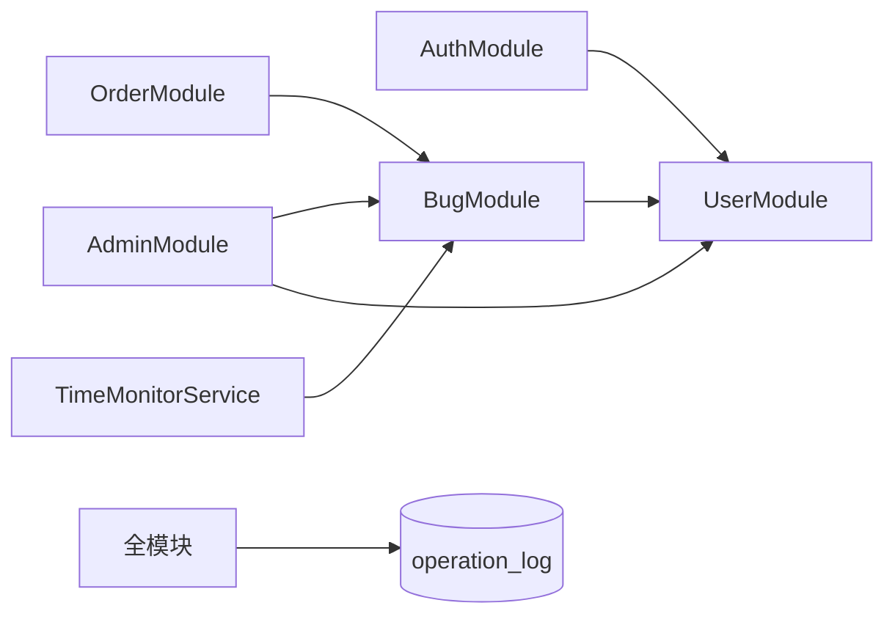
  

### 4.3 数据存储层

  数据存储层以 MySQL 为核心，负责平台所有结构化数据的持久化，包括用户、Bug、运营日志、时效规则等。
  后端通过 TypeORM 与 MySQL 交互，完成增删改查与关联查询；对核心表关键字段建立索引（如 user 的 phone、email，bug 的 tech_stack、status、publish_time 等），提升列表筛选与关键词搜索效率；对密码等敏感数据使用 bcrypt 加密存储，对状态修改、人工介入等核心操作写入 operation_log，保障数据安全与可追溯。
  部署上支持通过 Docker Compose 一键启动 MySQL 与应用，数据库名为 bug_platform，字符集 utf8mb4。

**图 4-4 平台部署关系图（Nginx + Node + MySQL）**

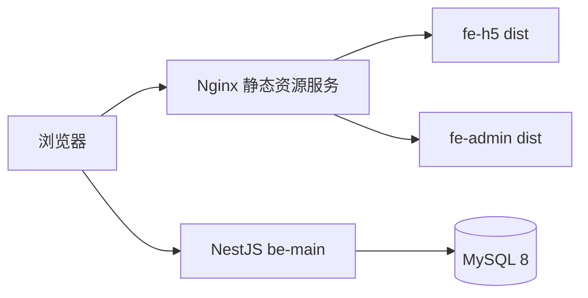
  

### 4.4 运营支撑层

  运营支撑层适配“人工运营 + 社群对接”模式，连接平台与线下社群，为人工运营提供工具。
  该层通过调用后端管理接口获取数据，实现超期/预警 Bug 标记展示、人工介入（状态修改与运营备注）、操作日志查看与时效规则配置；后续可扩展对接微信/QQ 机器人，实现自动提醒与社群信息同步。
  整体请求流程为：用户端/管理端发起请求 → 前端 Axios 携带 JWT 请求后端 → 后端鉴权与参数校验 → 业务模块处理并与数据存储层交互 → 返回结果至前端；管理员人工介入时需超级管理员权限，操作写入 operation_log；时效监控由后端定时任务（如每 5 分钟）自动扫描并更新 Bug 的 time_status，运营端从接口获取最新列表进行提醒与介入。

**图 4-5 运营支撑流程图**

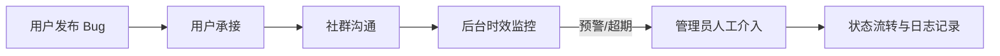

综上，第四章完成了从架构分层到运营闭环的总体设计论证。该设计将用户协作、后台运营与时效监管统一在同一技术体系内，为后续功能实现与性能优化提供了可扩展基础。
  

---

## 五、功能模块设计

本章从业务视角说明平台核心模块的职责边界与交互关系，并结合流程图展示关键状态流转，以体现系统设计的完整性与可实现性。

### 5.1 用户模块

  作为平台基础模块，负责用户身份与权限管理，为其他模块提供身份支撑。
  角色分为普通用户（USER）、普通管理员（ADMIN）、超级管理员（SUPER_ADMIN）。
  核心功能包括用户注册、登录（支持手机号/邮箱+密码）、个人信息查询与修改、权限与角色分配。
  该模块与所有业务模块关联：发布/承接 Bug、管理员人工介入等均依赖用户身份校验；用户表存储 contact_info 等字段，为社群对接提供基础信息。

**图 5-1 用户权限分层与访问控制关系图**

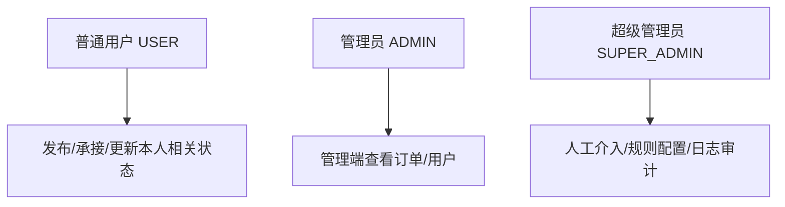
  

### 5.2 Bug 发布与承接模块

  作为核心业务模块，负责 Bug 全生命周期管理。
  核心功能包括 Bug 发布（标题、技术栈、富文本问题描述、预期效果、可选社群信息）、Bug 承接（唯一承接、记录承接人与承接时间）、Bug 状态更新（待解决→已承接→沟通中→已解决，含运营备注）、社群对接指引（承接成功后展示）、个人 Bug 记录（我发布的/我承接的）。
  该模块依赖用户模块做身份校验，为列表筛选与后台管理提供数据来源；状态与时间字段为时效监控提供依据。

**图 5-2 Bug 生命周期状态流转图**

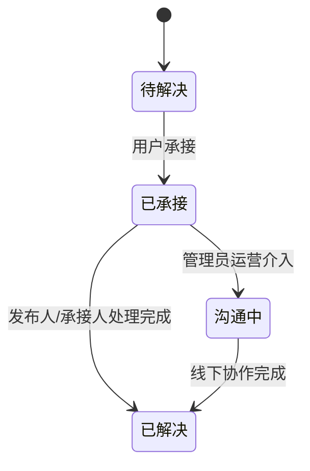
  

### 5.3 Bug 列表筛选模块

  负责 Bug 的精准筛选与展示，提升匹配效率。
  功能包括多条件筛选（技术栈、状态、时效状态）、关键词模糊搜索（标题与描述）、分页、按发布时间排序、Bug 详情查看。
  列表数据由后端 Bug 模块的 findList 方法提供，通过 TypeORM 条件拼接与关键词 LIKE 查询实现，返回分页结果及发布人/承接人简要信息，支撑用户端与管理端列表页。

**图 5-3 Bug 列表筛选流程图**

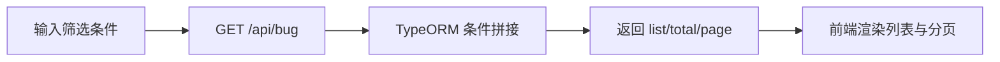
  

### 5.4 后台管理模块

  为人工运营提供工具，仅对管理员开放。
  核心功能包括：时效监控（可配置时效规则、定时任务自动标记即将超期/已超期、超期/预警列表查询）；人工介入（超级管理员可修改订单状态并填写运营备注，操作记入 operation_log）；订单与 Bug 管理（列表、详情、统计）；用户管理（列表、角色与状态管理、禁用/启用、创建/软删）；运营日志（按操作人、类型、时间筛选与查看）；时效规则配置（规则增删改查与启用/禁用）。
  该模块依赖用户、Bug、运营日志与时效规则等数据，是“人工运营 + 社群对接”模式的核心保障。

**图 5-4 后台管理功能结构图**

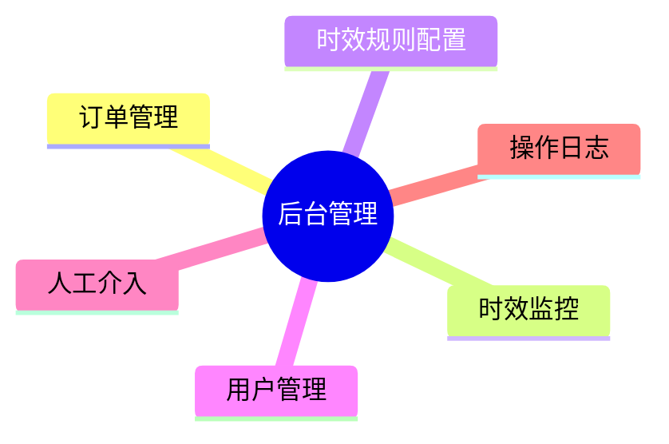

通过上述模块化设计，平台实现了“用户协作侧”与“运营管理侧”的职责解耦，保证了核心业务流程的可追踪、可干预与可扩展。
  

---

## 六、数据库设计

为支撑平台高频筛选、状态流转与运营审计需求，本章从表结构、关联关系与核心业务流程三个层面进行数据库设计说明，并通过结构图与流程图加强可读性。

**图 6-1 数据库 E-R 关系图**

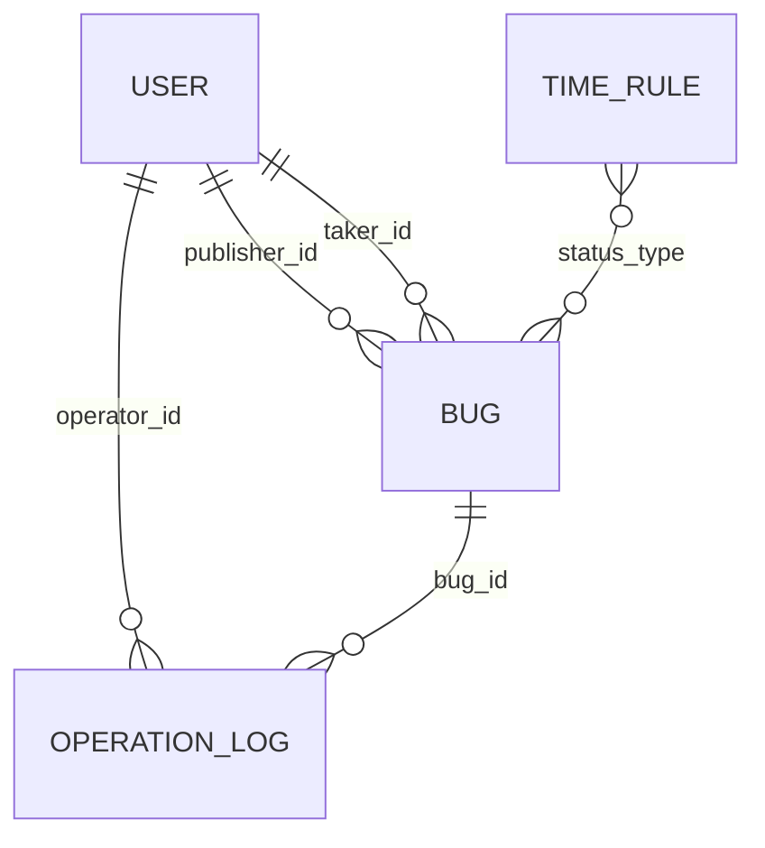

### 6.1 用户表（user）

  存储用户核心信息，为所有业务表的基础。
  主要字段：id（BIGINT，主键自增）、username（VARCHAR(50)，唯一）、phone（VARCHAR(20)，唯一）、email（VARCHAR(100)，唯一）、password（VARCHAR(255)，加密存储）、intro（TEXT，可空）、role（TINYINT，0 普通用户/1 管理员/2 超级管理员）、contact_info（VARCHAR(255)，可空）、status（TINYINT，0 正常/1 禁用）、create_time、update_time、is_delete（软删除）。
  对 phone、email、username 建唯一索引以支持登录与唯一性校验。
  

### 6.2 Bug 信息表（bug）

  存储 Bug 核心信息，与 user 通过 publisher_id、taker_id 关联。
  主要字段：id、title（VARCHAR(50)）、tech_stack（VARCHAR(100)）、description（LONGTEXT，富文本）、expect_effect（VARCHAR(500)）、publisher_id、taker_id（可空）、status（TINYINT，0 待解决/1 已承接/2 沟通中/3 已解决）、publish_time、take_time（可空）、last_update_time、time_status（TINYINT，0 正常/1 即将超期/2 已超期）、community_info、operation_note（可空）、is_delete。
  对 tech_stack、status、publish_time、time_status、publisher_id、taker_id 等建索引以支持筛选与时效监控。
  

### 6.3 运营日志表（operation_log）

  存储运营与关键操作记录，用于追溯。
  主要字段：id、operator_id（关联 user.id）、bug_id（可空，关联 bug.id）、operation_type（TINYINT，如 0 发布/1 承接/2 状态更新/3 人工介入/4 禁用用户/5 创建用户/6 删除用户）、operation_content（TEXT）、operation_time、ip_address（可空）。
  对 operator_id、bug_id、operation_type、operation_time 建索引以支持按人、按 Bug、按类型与时间筛选。
  

### 6.4 时效规则配置表（time_rule）

  存储时效监控规则，支持后台配置。
  主要字段：id、rule_name（VARCHAR(100)）、status_type（TINYINT，关联 Bug 状态，如 1 已承接/2 沟通中）、warn_hour（INT，预警时长小时）、expire_hour（INT，超期时长小时）、update_time、is_enable（TINYINT，0 禁用/1 启用）。
  定时任务仅处理 is_enable=1 的规则，按 status_type 筛选对应状态的 Bug，以 take_time 或 last_update_time 为参考时间进行预警/超期判定。
  

### 6.5 数据表关联关系

  user 与 bug：一对多。
  一个用户可发布多个 Bug、承接多个 Bug；一个 Bug 仅有一个发布人、一个承接人。
  user 与 operation_log：一对多，每条日志对应一个操作人。
  bug 与 operation_log：一对多，一个 Bug 可对应多条日志（发布、承接、状态更新、人工介入等）。
  time_rule 与 bug：通过 status_type 间接关联，一条规则对应某一 Bug 状态下的所有 Bug，用于时效计算。

为提升复杂场景下的查询效率，本研究在 `bug.status`、`bug.time_status`、`bug.publish_time`、`operation_log.operation_time` 等高频筛选字段上建立索引，并在列表接口中采用分页查询，避免全表扫描带来的性能问题。
  

### 6.6 核心业务流程设计

  核心流程为：Bug 发布 → Bug 承接 → 社群对接 → 状态更新 → 时效监控 → 人工介入。
  发布：用户填写标题、技术栈、富文本描述、预期效果后提交，后端创建记录、状态设为待解决、记录 publish_time 并写入操作日志。
  承接：其他用户点击承接，后端校验状态为待解决后更新 taker_id、status=已承接、take_time 并写日志，前端展示社群对接指引。
  状态更新：发布人/承接人可将状态更新为沟通中或已解决，管理员可将订单改为沟通中（拉群）；后端更新 last_update_time 并写日志。
  时效监控：定时任务按 time_rule 与 take_time/last_update_time 计算，将 time_status 更新为正常/即将超期/已超期。
  人工介入：超级管理员在后台修改订单状态并填写 operation_note，后端更新 bug 表并写入 operation_log（操作类型为人工介入）。

**图 6-2 核心业务闭环流程图**

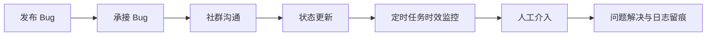
  

---

## 七、前端详细实现与代码设计

本章重点展示前端工程中的关键实现代码。与一般说明性文字不同，本章通过“代码片段 + 设计意图 + 运行效果”的方式说明系统可实现性。

### 7.1 前端开发环境与工程结构

  开发工具：VS Code / WebStorm，Chrome。
  运行环境：Node.js（v20+）、pnpm（9+）。
  构建工具：Vite（7+）。
  monorepo 下前端包：fe-h5（用户端）、fe-admin（管理端），共享包 @bug/shared 提供类型与枚举（如 BugStatus、TimeStatus、UserRole）。
  用户端核心依赖：vue@3.5+、vue-router@5、pinia@3、axios、@wangeditor-next/editor-for-vue（富文本）。
  管理端额外依赖：element-plus、@element-plus/icons-vue。
  项目初始化：在根目录 pnpm install 安装 workspace 依赖；各前端包内配置 Vue Router（用户端/管理端路由分离）、路由守卫（登录与角色校验）；配置 Vite 的 server.proxy 解决开发阶段跨域；封装 Axios 实例，请求拦截器注入 Authorization: Bearer \<token\>，响应拦截器统一处理 401/403/500 并提示。

**图 7-1 前端工程目录结构图**

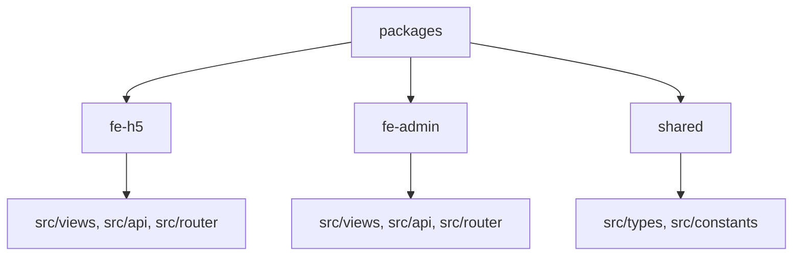
  

### 7.2 公共功能与代码设计

  路由与权限：用户端路由示例 /home、/publish、/bug/:id、/my-bugs；管理端 /admin、/admin/orders、/admin/users、/admin/logs、/admin/time-rules。
  路由守卫中从 Pinia 的 userStore 读取 token 与 role，未登录跳转登录页，普通用户访问 /admin 时重定向或 403。
  请求封装：axios 实例 baseURL 指向后端；请求拦截器从 localStorage 或 store 取 token 写入 headers；响应拦截器对 data 解包，对 401 清空登录状态并跳转登录，对 4xx/5xx 弹出 message。
  状态管理：Pinia 定义 userStore（user、token、role）、可选 bugFilterStore（筛选条件、分页），登录成功后写入 userStore，各页面通过 store 获取用户与权限。
  类型与枚举：前端从 @bug/shared 引入 BugStatus、TimeStatus、UserRole、BugItem、PaginatedResult 等，与后端 DTO 和接口返回保持一致，减少手写类型错误。

关键代码如下所示，体现了请求拦截器中统一注入 JWT 令牌与统一错误处理的实现方式：

```ts
import axios, { type AxiosInstance, type InternalAxiosRequestConfig } from 'axios'
import type { ApiResponse } from '@bug/shared'

const BASE_URL = import.meta.env.VITE_API_BASE_URL || 'http://localhost:3000'

export const request: AxiosInstance = axios.create({
  baseURL: BASE_URL,
  timeout: 10000,
  headers: { 'Content-Type': 'application/json' },
})

request.interceptors.request.use((config: InternalAxiosRequestConfig) => {
  const token = localStorage.getItem('token')
  if (token) {
    config.headers.Authorization = `Bearer ${token}`
  }
  return config
})

request.interceptors.response.use(
  (response) => {
    const res = response.data as ApiResponse<unknown>
    if (res.code !== 0) return Promise.reject(new Error(res.message || '请求失败'))
    return response
  },
  (err) => Promise.reject(new Error(err.response?.data?.message || err.message || '网络错误')),
)
```

上述封装将接口异常处理策略统一到网络层，减少了视图层重复判断逻辑，提升了代码可维护性。
  

### 7.3 用户端：用户与 Bug 发布承接

  注册与登录：表单使用 v-model 绑定 RegisterDto/LoginDto 对应字段，校验规则（如手机号正则、密码长度、必填）可用 Vue 或 element-plus 的 form 校验；注册请求 POST /api/user/register，登录请求 POST /api/auth/login，登录成功后保存 token 与用户信息到 userStore 并跳转首页。
  Bug 发布：表单含标题、技术栈（输入或选择）、问题描述（wangEditor 富文本）、预期效果、可选社群信息；提交前前端校验必填与长度；POST /api/bug 传 CreateBugDto，成功后跳转详情或列表。
  Bug 承接：详情页在 status 为待解决且当前用户非发布人时展示“承接”按钮；POST /api/bug/:id/take 成功后更新本地状态并弹出社群对接指引（展示 community_info、发布人 contact_info）。
  状态更新：发布人/承接人可选择“沟通中”“已解决”，POST /api/bug/:id/status 传 UpdateStatusDto（status、可选 operationNote），成功后无刷新更新详情。
  个人 Bug 记录：调用 GET /api/order/my，传参 type=published 或 type=taken 分别获取“我发布的”“我承接的”列表（分页）。


  

### 7.4 用户端：Bug 列表与筛选

  列表页：筛选区（技术栈、状态、时效状态、关键词）、表格与分页。
  筛选变化时带参数请求 GET /api/bug（查询参数 techStack、status、timeStatus、keyword、page、pageSize）。
  后端 BugService.findList 使用 TypeORM 的 where 与 createQueryBuilder 拼接条件，关键词用 LIKE 匹配 title、description，分页用 skip/take，返回 { list, total, page, pageSize }。
  前端用 list 渲染表格，用 total 与 pageSize 渲染分页组件；点击行跳转 /bug/:id 查看详情，详情请求 GET /api/bug/:id 获取完整信息与发布人/承接人，富文本用 v-html 或富文本组件回显。


  

### 7.5 管理端实现

  时效监控与订单列表：管理端订单列表接口 GET /api/admin/orders，支持 status、timeStatus、keyword、分页；GET /api/admin/overdue-bugs 可获取超期/预警 Bug 列表。
  列表展示 Bug 标题、发布人、承接人、状态、时效状态、发布时间等，超期项可高亮；定时刷新（如每 5 分钟）或手动刷新以与后端定时任务同步。
  人工介入：仅超级管理员可见“人工介入”操作；弹窗中选择目标状态并填写 operationNote，POST /api/admin/manual-intervention 传 bugId、status、operationNote，后端更新 bug 并写入 operation_log。
  用户管理：GET /api/admin/users 分页与筛选，禁用/启用、创建用户、软删除等调用对应接口，敏感操作写操作日志。
  运营日志：GET /api/admin/operation-logs（仅超级管理员），支持按 bugId、操作人、操作类型、开始/结束时间、分页筛选，展示 operator、operationType、operationContent、operationTime。
  时效规则配置：GET /api/admin/time-rules 展示规则列表（含启用/禁用），超级管理员可 POST 新增、PUT 编辑、PUT :id/enable 启用/禁用；定时任务仅处理 is_enable=1 的规则。

管理端权限控制核心代码如下。该逻辑根据路由元信息中的角色列表进行鉴权，实现了页面级访问控制：

```ts
router.beforeEach(async (to, _from, next) => {
  const auth = useAuthStore()
  if (to.meta.auth && !auth.isLoggedIn) {
    next({ name: 'Login', query: { redirect: to.fullPath } })
    return
  }
  if (auth.token && !auth.user) {
    await auth.fetchProfile()
  }
  if (to.meta.admin && !auth.isAdmin) {
    next({ name: 'Forbidden' })
    return
  }
  const routeRoles = to.meta.roles as number[] | undefined
  if (routeRoles && auth.user && !routeRoles.includes(auth.user.role)) {
    next({ name: 'Forbidden' })
    return
  }
  next()
})
```

**图 7-2 管理端核心页面示意图（订单列表/时效规则/操作日志）**


  

---

## 八、后端详细实现与代码设计

本章结合 NestJS 实际工程代码，展示鉴权、业务查询、定时任务与运营日志等关键实现，作为系统“可运行、可维护、可扩展”的技术依据。

### 8.1 后端开发环境与项目结构

  开发工具：VS Code / WebStorm，Navicat，Docker。
  运行环境：Node.js v20+、pnpm 9+。
  核心依赖：@nestjs/core@11、@nestjs/typeorm、@nestjs/jwt、@nestjs/passport、passport-jwt、@nestjs/schedule、mysql2、typeorm、bcrypt、class-validator、class-transformer、@nestjs/swagger。
  项目为 monorepo 下的 packages/be-main，与 fe-admin、fe-h5、shared 同仓库。
  

  数据库环境：MySQL 8+，推荐 Docker Compose 启动，库名 bug_platform，端口 3306，字符集 utf8mb4；可使用 Navicat、DBeaver 等工具连接管理。
  使用 TypeORM 的 synchronize 或迁移维护表结构，对 user、bug、operation_log、time_rule 的关键字段建索引；生产环境建议关闭 synchronize 并做定期备份。
  

  初始化：配置 TypeORM 连接 MySQL（库名 bug_platform），实体扫描路径指向 entities；配置 JWT 的 secret 与 expiresIn（如 7d）；全局启用 ValidationPipe；注册 JwtModule、PassportModule、ScheduleModule；全局异常过滤器封装统一错误格式（code、message）。

**图 8-1 后端工程目录结构图**

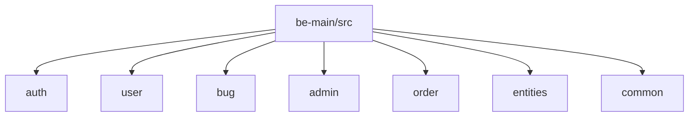
  

### 8.2 公共模块与代码设计

  JWT 鉴权：JwtModule 使用 ConfigService 读取 JWT_SECRET 与 JWT_EXPIRES_IN。
  JwtStrategy（PassportStrategy(Strategy)）从 Authorization Bearer 中提取 token，secretOrKey 与后端一致，validate(payload) 中根据 payload.sub 查询用户，返回 { id, username, role } 挂载到 req.user。
  JwtAuthGuard 继承 AuthGuard('jwt')，在需要鉴权的控制器或方法上使用 @UseGuards(JwtAuthGuard)。
  CurrentUser 装饰器通过 createParamDecorator 从 request.user 中取出指定字段（如 id、role），供业务层使用。
  角色守卫：RolesGuard 读取 @Roles() 元数据（如 UserRole.SUPER_ADMIN），与 req.user.role 比较，不满足则抛 ForbiddenException。
  参数校验：在各 DTO 上使用 class-validator 装饰器，如 @IsString()、@IsNotEmpty()、@MinLength(6)、@MaxLength(50)、@Matches(/正则/)、@IsIn([...])；Controller 方法参数前加 @Body()、@Param()、@Query()，ValidationPipe 在校验失败时抛 BadRequestException。
  全局异常过滤：实现 ExceptionFilter，catch 各类异常，将 message 与 statusCode 封装为 { code, message } 返回，避免向客户端暴露堆栈。

以下代码展示了 JWT 策略的核心校验逻辑。系统通过 `validate` 方法将用户身份解析为统一的请求上下文对象：

```ts
@Injectable()
export class JwtStrategy extends PassportStrategy(Strategy) {
  constructor(
    config: ConfigService,
    private userService: UserService,
  ) {
    super({
      jwtFromRequest: ExtractJwt.fromAuthHeaderAsBearerToken(),
      ignoreExpiration: false,
      secretOrKey: config.get('jwtSecret') || 'bug-platform-secret-key',
    })
  }

  async validate(payload: { sub: number; username: string; role: number }) {
    const user = await this.userService.findById(payload.sub)
    if (!user) return null
    return { id: user.id, username: user.username, role: user.role }
  }
}
```

为保证管理员能力的安全边界，系统进一步通过角色守卫限制高权限接口访问：

```ts
@Injectable()
export class RolesGuard implements CanActivate {
  constructor(private reflector: Reflector) {}

  canActivate(context: ExecutionContext): boolean {
    const requiredRoles = this.reflector.getAllAndOverride<UserRole[]>(ROLES_KEY, [
      context.getHandler(),
      context.getClass(),
    ])
    if (!requiredRoles?.length) return true
    const { user } = context.switchToHttp().getRequest()
    return requiredRoles.some((role) => user?.role === role)
  }
}
```
  

### 8.3 用户模块与认证

  实体设计：User 实体对应 user 表，字段与 6.1 节一致，使用 @Column、@CreateDateColumn、@UpdateDateColumn；关联 OneToMany 到 Bug（publishedBugs、takenBugs）与 OperationLog（operationLogs）。
  DTO 设计：RegisterDto 包含 username、phone、email、password、contactInfo（可选）、intro（可选），校验如 @Matches(/^1[3-9]\d{9}$/) 手机号、@Matches(/^[\w.-]+@[\w.-]+\.\w+$/) 邮箱、@MinLength(6) 密码；LoginDto 包含 account（手机或邮箱）、password。
  服务层：UserService.register 先按 phone、email、username 查重，冲突则 ConflictException；使用 bcrypt.hash(dto.password, 10) 加密后 create 并 save。
  UserService.findByAccount(account) 支持 phone 或 email 查询；validatePassword(plain, hash) 使用 bcrypt.compare。
  AuthService.sign(user) 使用 jwtService.sign({ sub: user.id, username, role }) 生成 token；登录流程：AuthController 接收 LoginDto，UserService.findByAccount + validatePassword 校验通过后调用 AuthService.sign 返回 token 与用户信息。
  控制器：POST /api/user/register、POST /api/auth/login 无需鉴权；GET /api/user/profile 使用 JwtAuthGuard 与 CurrentUser('id') 返回当前用户信息。
  

### 8.4 Bug 模块与列表查询

  实体设计：Bug 实体对应 bug 表，字段与 6.2 节一致；ManyToOne 关联 User（publisher、taker），OneToMany 关联 OperationLog。
  DTO：CreateBugDto 含 title、techStack、description、expectEffect、communityInfo（可选），校验 @IsNotEmpty、@MaxLength(50) 等；UpdateStatusDto 含 status（@IsIn([BugStatus.COMMUNICATING, BugStatus.RESOLVED])）、operationNote（可选）。
  服务层：BugService.create(dto, publisherId) 使用 bugRepo.create 注入 publisherId、status=PENDING、timeStatus=NORMAL，save 后写 operation_log（OperationType.BUG_PUBLISH）。
  BugService.take(bugId, takerId) 校验 bug 存在且 status===PENDING，更新 takerId、status=TAKEN、takeTime，写 BUG_TAKE 日志。
  BugService.updateStatus(bugId, dto, operator) 校验权限（超管可改任意；发布人/承接人可改自己相关；管理员可改状态为 COMMUNICATING），更新 status 与可选 operationNote，写 STATUS_UPDATE 日志。
  列表查询：BugService.findList(params) 接收 techStack、status、timeStatus、keyword、page、pageSize；无 keyword 时用 findAndCount + where 条件；有关键词时用 createQueryBuilder，.andWhere('(bug.title LIKE :kw OR bug.description LIKE :kw)', { kw: '%'+keyword+'%' }) 再拼接其他条件，orderBy('bug.publish_time','DESC')，skip/take 分页；查询到 list 后按 publisherId（及 takerId）批量查 User 补全 publisher/taker 简要信息，返回 { list, total, page, pageSize }。
  控制器：POST /api/bug（create）、POST /api/bug/:id/take（take）、POST /api/bug/:id/status（updateStatus）、GET /api/bug（findList，查询参数）、GET /api/bug/:id（findById），需鉴权处加 JwtAuthGuard 与 CurrentUser。

下述代码为列表查询关键实现，通过 QueryBuilder 完成关键词检索与多条件组合，满足平台筛选性能要求：

```ts
if (keyword) {
  const qb = this.bugRepo
    .createQueryBuilder('bug')
    .where('bug.is_delete = 0')
    .andWhere('(bug.title LIKE :kw OR bug.description LIKE :kw)', {
      kw: `%${keyword}%`,
    })
  if (techStack) qb.andWhere('bug.tech_stack LIKE :tech', { tech: `%${techStack}%` })
  if (status !== undefined) qb.andWhere('bug.status = :status', { status })
  if (timeStatus !== undefined) qb.andWhere('bug.time_status = :timeStatus', { timeStatus })
  total = await qb.getCount()
  list = await qb
    .orderBy('bug.publish_time', 'DESC')
    .skip((page - 1) * pageSize)
    .take(pageSize)
    .getMany()
}
```
  

### 8.5 后台管理模块

  服务层：AdminService 依赖 Bug、User、OperationLog、TimeRule 的 Repository 与 DataSource。
  ensureAdmin(role)、ensureSuperAdmin(role) 用于接口内权限校验。
  getAdminOrders、getAdminOrderById、getOverdueBugs 等为管理端提供订单列表、详情与超期列表；manualIntervention(bugId, operatorId, status, operationNote) 仅超级管理员可调，更新 bug.status 与 bug.operationNote，并写 operation_log（OperationType.MANUAL_INTERVENTION，内容含状态变更与备注）。
  getTimeRules 返回 is_enable=1 的 time_rule 列表；用户管理相关方法如 getUserList、createUser、updateUserStatus、softDeleteUser 等操作用户表并视情况写日志。
  控制器：/api/admin 下所有接口先 JwtAuthGuard，再在方法内 ensureAdmin 或对敏感操作加 RolesGuard + @Roles(UserRole.SUPER_ADMIN)；POST /api/admin/manual-intervention 接收 body.bugId、body.status、body.operationNote，调用 manualIntervention；GET /api/admin/time-rules、/api/admin/orders、/api/admin/overdue-bugs、/api/admin/operation-logs、用户 CRUD 等对应到 AdminService 各方法（时效规则支持增删改查与启用/禁用）。
  

### 8.6 定时任务与时效监控

  在 TimeMonitorService 中注入 Bug 与 TimeRule 的 Repository。
  使用 @Cron('*/5 * * * *') 表示每 5 分钟执行一次。
  逻辑：查询 is_enable=1 的 time_rule 列表；对每条规则，根据 rule.statusType 确定要处理的 Bug 状态（如已承接、沟通中）；计算当前时间与规则中 warn_hour、expire_hour 对应的阈值时间（当前时间 - warn_hour*3600*1000 与 - expire_hour*3600*1000）；查询该状态下未删除的 Bug；对每个 Bug，根据 statusType 取参考时间 refTime（已承接取 take_time，沟通中取 last_update_time）；若 refTime 早于等于 expire 阈值则 time_status=EXPIRED，早于等于 warn 阈值则 WARNING，否则 NORMAL；调用 bugRepo.update(bug.id, { timeStatus }) 更新，不写 operation_log。
  这样运营端通过 getOverdueBugs、getAdminOrders 等接口即可看到最新时效状态并做人工提醒与介入。

时效监控关键实现如下，体现了规则驱动的批量状态更新机制：

```ts
@Cron('*/5 * * * *')
async checkTimeStatus() {
  const rules = await this.ruleRepo.find({ where: { isEnable: 1 } })
  for (const rule of rules) {
    const now = new Date()
    const warnThreshold = new Date(now.getTime() - rule.warnHour * 60 * 60 * 1000)
    const expireThreshold = new Date(now.getTime() - rule.expireHour * 60 * 60 * 1000)
    const bugs = await this.bugRepo.find({ where: { status: rule.statusType, isDelete: 0 } })
    for (const bug of bugs) {
      const refTime = rule.statusType === BugStatus.TAKEN ? bug.takeTime : bug.lastUpdateTime
      if (!refTime) continue
      const ref = new Date(refTime)
      if (ref <= expireThreshold) await this.bugRepo.update(bug.id, { timeStatus: TimeStatus.EXPIRED })
      else if (ref <= warnThreshold) await this.bugRepo.update(bug.id, { timeStatus: TimeStatus.WARNING })
      else await this.bugRepo.update(bug.id, { timeStatus: TimeStatus.NORMAL })
    }
  }
}
```

**图 8-2 时效监控任务执行流程图**

```mermaid
flowchart LR
  C[@Cron 每5分钟触发] --> R[读取启用规则 time_rule]
  R --> B[按状态查询 Bug]
  B --> J[计算 warn/expire 阈值]
  J --> U[更新 time_status]
  U --> A[后台列表读取并人工介入]
```
  

### 8.7 运营日志与数据追溯

  运营日志在关键业务完成后由各 Service 主动写入 operation_log 表，不提供修改与删除接口。
  写入内容包含 operatorId、bugId（可为空）、operationType（枚举值）、operationContent（拼接描述，如“状态更新: 1 -> 2, 备注: xxx”）、operationTime。
  OperationType 在 @bug/shared 中统一定义（BUG_PUBLISH、BUG_TAKE、STATUS_UPDATE、MANUAL_INTERVENTION、USER_DISABLE 等），前后端与后端多模块共用，保证类型一致与可追溯。
  查询运营日志时可按 operator_id、operation_type、bug_id、operation_time 筛选与分页，便于管理员审计与纠纷追溯。

通过关键代码与流程图可见，后端并非简单 CRUD，而是具备鉴权、状态机、定时规则与审计追溯能力，能够支撑平台的真实运营场景。
  

---

## 九、平台功能测试

### 9.1 测试目的

  本次测试围绕平台核心功能完整性、人工运营流程可行性、时效监控准确性、权限控制有效性展开，通过模拟普通用户与管理员的实际操作场景，对平台所有核心功能进行全面测试，验证平台是否符合需求分析与设计要求，是否能够支撑“线上匹配 + 线下协作 + 人工运营”的核心模式，发现并修复开发过程中的漏洞与问题，保证平台的稳定运行、功能可用与运营落地。
  

  延续开发环境配置，同时搭建模拟生产环境，实现前端静态资源部署在 Nginx、后端服务与数据库独立部署，或采用 Docker Compose 一体化部署，模拟真实使用场景。
  

  本次测试采用黑盒测试为主、白盒测试为辅的方式，覆盖功能测试、流程测试、时效测试、权限测试、性能测试、兼容性测试六大类型，核心测试用例围绕用户、Bug、筛选、后台管理四大模块设计，每个测试用例包含测试目的、测试步骤、预期结果、实际结果、测试结论，核心测试用例如下。
  

### 9.2 核心功能完整性

| 测试用例ID | 测试模块 | 测试目的 | 测试步骤 | 预期结果 |
|------------|----------|----------|----------|----------|
| F001 | 用户模块 | 普通用户注册 | 进入注册页面，输入合法用户名、手机号、邮箱、密码、联系方式（contact_info），点击注册 | 注册成功，跳转到登录页，数据库创建用户记录，密码加密存储，contact_info 正确保存 |
| F002 | 用户模块 | 管理员登录 | 输入管理员账号（手机号或邮箱）及密码，点击登录 | 登录成功，获得 JWT，可访问管理端后台及管理员接口 |
| F003 | Bug 模块 | Bug 发布（富文本） | 登录后进入发布页，填写标题、技术栈、富文本问题描述（wangEditor）、预期效果，提交 | 发布成功，跳转到详情页，富文本正常展示，数据库 bug 表记录完整，状态为待解决 |
| F004 | Bug 模块 | Bug 承接 | 登录另一账号，进入待解决 Bug 详情页，点击“承接 Bug”按钮 | 承接成功，状态更新为已承接，弹出社群对接指引，数据库更新 taker_id、take_time |
| F005 | Bug 模块 | 状态更新 | 承接人登录，将 Bug 状态从已承接更新为沟通中（或发布人/承接人更新为已解决） | 状态更新成功，详情页展示最新状态，数据库更新 last_update_time，生成运营日志 |
| F006 | 列表模块 | 多条件筛选 | 进入列表页，选择技术栈、状态（如待解决）、时效状态，输入关键词，点击搜索 | 列表展示符合所有条件的 Bug，无符合条件则显示“暂无数据”，分页正常 |
| F007 | 后台管理 | 人工介入改状态 | 超级管理员登录，进入超期 Bug 详情页，将状态改为已解决并添加运营备注 | 状态修改成功，备注同步展示，数据库更新 status、operation_note，生成运营日志（操作类型为人工介入） |
| F008 | 后台管理 | 时效规则配置 | 管理员新增规则：关联状态已承接（或沟通中），提醒时长 48 小时，超期时长 72 小时，启用规则 | 规则创建成功，时效规则表记录完整，定时任务（每 5 分钟）按新规则执行并更新 Bug 时效状态 |

### 9.3 流程测试：人工运营全流程可行性

  测试目的：验证“Bug 发布→承接→社群对接→状态更新→时效监控→人工介入”全运营流程的可行性。
  

  测试步骤：普通用户 A 注册登录，发布 Bug（状态待解决，技术栈如 React）；普通用户 B 注册登录，筛选对应技术栈，承接该 Bug，查看社群对接指引；用户 B 或管理员将状态更新为沟通中，模拟社群沟通；管理员配置时效规则：已承接状态，提醒时长 2 小时，超期时长 4 小时；等待约 2 小时，查看后台时效监控，确认 Bug 标记为“即将超期”；等待至约 4 小时，确认 Bug 标记为“已超期”，管理员进行人工提醒（线下或预留消息接口）；若用户 A 未反馈，超级管理员进行人工介入，修改状态为已解决，添加备注“社群沟通无果，人工标记”；查看全流程运营日志，确认所有操作均被记录。
  

  预期结果：全流程各环节衔接顺畅，状态更新及时，时效监控标记准确（定时任务每 5 分钟执行），人工介入操作有效且仅超级管理员可执行，运营日志完整覆盖所有步骤。
  

### 9.4 时效测试：时效监控准确性

| 测试用例ID | 测试目的 | 测试步骤 | 预期结果 |
|------------|----------|----------|----------|
| T001 | 即将超期标记准确性 | 配置规则：沟通中状态，提醒时长 1 小时，超期时长 3 小时，更新 Bug 状态为沟通中 | 约 1 小时后（结合定时任务周期），Bug 时效状态标记为即将超期 |
| T002 | 已超期标记准确性 | 基于 T001，继续等待至累计约 3 小时 | 约 3 小时后，Bug 时效状态标记为已超期 |
| T003 | 时效状态自动恢复 | 基于 T002，用户或管理员将 Bug 状态更新为已解决，查看时效状态 | 该 Bug 不再被“已承接/沟通中”规则扫描，或时效状态恢复为正常 |
| T004 | 定时任务执行稳定性 | 时效规则已启用，定时任务每 5 分钟执行，连续运行 24 小时，查看时效标记记录 | 标记时间与规则一致，无漏标、错标 |

### 9.5 权限测试：角色与接口权限控制有效性

| 测试用例ID | 测试目的 | 测试步骤 | 预期结果 |
|------------|----------|----------|----------|
| R001 | 普通用户不可访问管理员接口 | 普通用户登录，直接访问管理端后台页面或通过 Postman 调用 /api/admin/* 接口 | 拒绝访问，前端重定向或返回 403，接口返回 403 无权限 |
| R002 | 非承接人/发布人不可随意更新 Bug 状态 | 普通用户 C 登录，进入用户 B 承接的 Bug 详情页，尝试将该 Bug 状态更新为已解决（非本人发布/承接） | 操作失败，接口返回“无权限操作订单状态”或类似提示 |
| R003 | 未登录用户不可操作核心功能 | 未登录状态，尝试访问发布页、承接 Bug、个人列表等 | 跳转到登录页，相关接口返回 401 未授权 |
| R004 | 管理员可禁用普通用户 | 管理员登录，找到指定用户，执行禁用操作 | 用户状态更新为禁用，该用户再次登录时提示账号已禁用 |

### 9.6 性能测试：高并发与大数据量处理

| 测试用例ID | 测试目的 | 测试步骤 | 预期结果 |
|------------|----------|----------|----------|
| S001 | 核心接口并发处理 | 使用压测工具对 Bug 发布、承接、状态更新等核心接口进行并发请求（如 200 用户同时操作） | 接口响应时间≤500ms，无数据丢失、错乱 |
| S002 | 大数据量筛选查询 | 向数据库插入约 10 万条 Bug 数据，进行多条件筛选与关键词搜索 | 查询结果返回≤1s，分页展示正常 |
| S003 | 定时任务大数据量处理 | 数据库存在大量待监控 Bug，定时任务每 5 分钟执行 | 定时任务单次执行时间在可接受范围内，不阻塞正常请求 |

### 9.7 兼容性测试：多终端多浏览器适配

  测试用例 ID：C001。
  测试目的：验证平台在多终端、多浏览器的兼容性，核心功能正常使用。
  

  测试步骤：在 Chrome、Firefox、Edge、Safari、微信内置浏览器中打开用户端与管理端，测试注册、登录、发布 Bug、筛选列表、富文本编辑等；在 Windows、Mac、Android、iOS 终端打开平台，测试核心按钮、表单、富文本编辑器（wangEditor）的可用性；模拟弱网环境，测试页面加载与接口请求的容错性。
  

  预期结果：各终端与浏览器下核心功能正常，页面布局无严重错乱，富文本编辑器可用；弱网环境有加载或错误提示。
  实际结果与结论可根据测试记录填写（如仅微信内置浏览器富文本部分样式差异，其余通过）。
  

### 9.8 测试总结

  本次对平台进行了功能、流程、时效、权限、性能与兼容性等多类测试，核心测试用例通过后，可认为平台功能完整、流程可行、时效准确、权限有效、性能与兼容性符合需求。
  

  测试结果表明：用户端（fe-h5）的 Bug 发布、承接、筛选、状态更新等功能正常；管理端（fe-admin）的时效监控、人工介入（超级管理员）、规则配置、用户与运营日志管理等功能落地有效；时效监控定时任务每 5 分钟执行稳定，标记准确；权限控制实现普通用户、管理员与超级管理员隔离；高并发与大数据量场景下接口与查询效率满足非功能需求。
  测试中发现的问题修复后，平台具备实际部署与运营落地条件。
  

### 9.9 迭代功能补充验证（安全与体验优化）

  在基本功能测试通过后，项目进一步完成了面向生产可用性的迭代优化，并进行针对性验证，重点包括以下四类：

  （1）业务规则优化：新增“发布人不可承接自己发布的 Bug”约束，避免虚假撮合；Bug 广场默认仅展示待承接（PENDING）数据，已承接订单不再进入可接单池，降低列表噪音并提升承接效率。

  （2）账号与权限边界优化：在保持统一用户体系的前提下，将 H5 关键写操作（发布、承接、状态更新）限制为普通用户角色（USER）；管理员/超级管理员主要通过后台执行运营与治理操作，降低角色混用带来的治理风险。

  （3）登录与页面体验优化：登录支持“用户名/手机号/邮箱”三种账号输入形式；H5 端补充 401 未授权自动跳转登录与 redirect 回跳；“我的”页面完成二级功能拆分（我的需求、我发布的、意见反馈/商务合作、规则说明），并统一空状态占位图展示，提升移动端信息结构与可用性。

  （4）风控与限流优化：后端新增多维限流机制，登录接口采用“IP + 设备 + 账号 + 接口全局”组合策略，业务写接口采用“userId + 设备 + 接口全局”组合策略；前端自动注入设备标识请求头（x-device-id）用于设备维度限流；同时提供 Nginx 网关层限流模板，实现“网关层 + 应用层”双层防护。

  补充验证结果显示，上述迭代在不破坏原有核心流程的前提下，显著提升了平台的安全性、可运营性与用户端使用体验。
  

---

## 十、总结与展望

### 10.1 研究总结

  本文针对开发者跨项目 Bug 解决效率低、线上协作无法落地调试、现有平台互动功能冗余等痛点，结合“线上匹配 + 线下协作 + 人工运营”的轻量化运营模式，设计并实现了基于 Vue3 + NestJS 的开发者 Bug 共享社区平台。
  项目采用 pnpm + Turbo 的 monorepo 架构，前端拆分为用户端（fe-h5）与管理端（fe-admin），后端为 NestJS 单体服务（be-main），共享包 @bug/shared 统一类型与常量，完成了从需求分析、架构设计、功能开发到全面测试的全流程工作。
  

  本平台的开发与实现，既解决了开发者跨项目 Bug 协作的实际痛点，提供了轻量化的 Bug 发布、承接与对接渠道，提升了协作效率；也在技术上实践了 monorepo、前后端分离、可配置时效规则与操作日志等设计，为后续商业变现（如服务费、会员制、精准技术对接）奠定了基础。
  在后续迭代中，平台进一步补齐了安全与治理能力，包括角色边界收敛、业务规则防刷与防滥用、登录与写接口多维限流，以及网关层限流模板化落地，为生产环境部署提供了更完整的工程化支撑。
  与此同时，平台在治理侧补充了超级管理员对恶意订单的处置能力（后台删除任意订单，采用软删除并写入日志），在用户侧明确了“发布人仅可删除未承接需求、已承接需求不可删除”的规则，进一步完善了从业务撮合到风险治理的闭环设计。
  

### 10.2 项目不足

  尽管平台已完成核心功能开发与测试，具备运营落地条件，但仍存在以下不足与可优化点：

  自动化程度较低：超期提醒、社群对接指引等目前依赖人工或手动触发，未实现自动化消息推送，随用户量与 Bug 量增长，人工成本会上升。
  社群对接未系统化：平台仅提供社群对接指引（群号、联系方式），未与微信群/QQ 群系统打通，社群内沟通内容与解决进度无法同步至平台，存在“平台—社群”数据孤岛。
  功能深度有待提升：目前以 Bug 发布、承接、筛选为核心，缺乏开发者画像、Bug 分类标签、解决方案沉淀、精准推荐等增值功能，用户粘性与平台价值可进一步挖掘。
  高可用部署待优化：当前多为单机或单容器部署，未实现分布式与容灾，生产环境需加强高可用与备份。
  数据统计与分析薄弱：管理端以数据查看与导出为主，缺乏多维度统计（如技术栈分布、承接成功率、超期率等），对运营策略支撑不足。
  

### 10.3 未来展望

  针对上述不足，结合轻量化 Bug 共享平台的商业方向，未来可从以下方面持续优化：

  对接微信/QQ 机器人：实现自动超期提醒、承接成功后自动拉群或推送指引、社群内指令同步更新平台 Bug 状态；将社群关键沟通信息同步为运营日志，打通“平台—社群”日志链路；平台状态更新与人工提醒通过机器人推送至社群，提升协作效率；在管理端集成群管理、消息群发等工具，实现“平台 + 社群”一体化运营。
  分布式与高可用：前端静态资源上 CDN，后端集群部署，数据库主从与定期备份，提升可用性与数据安全。
  性能优化：对核心筛选与查询接口引入 Redis 缓存、优化 SQL 与索引，提升大数据量下的响应速度。
  商业变现：探索基础服务费（如按解决订单收取一定比例）、会员制（精准推荐、解决方案库、广告屏蔽等增值服务）等模式。
  

